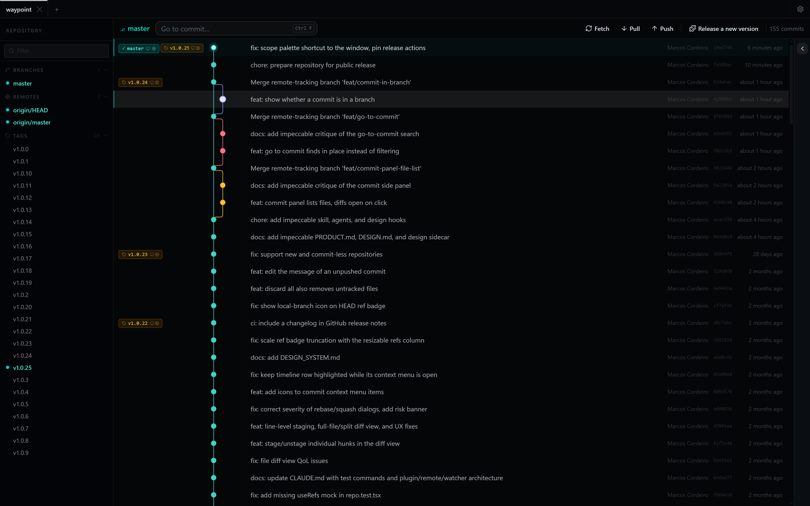
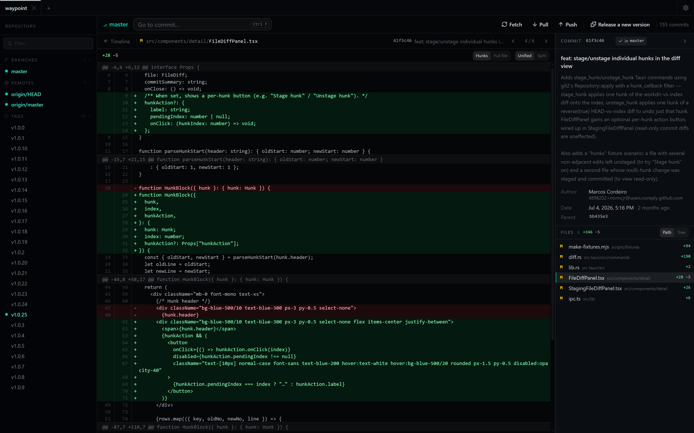
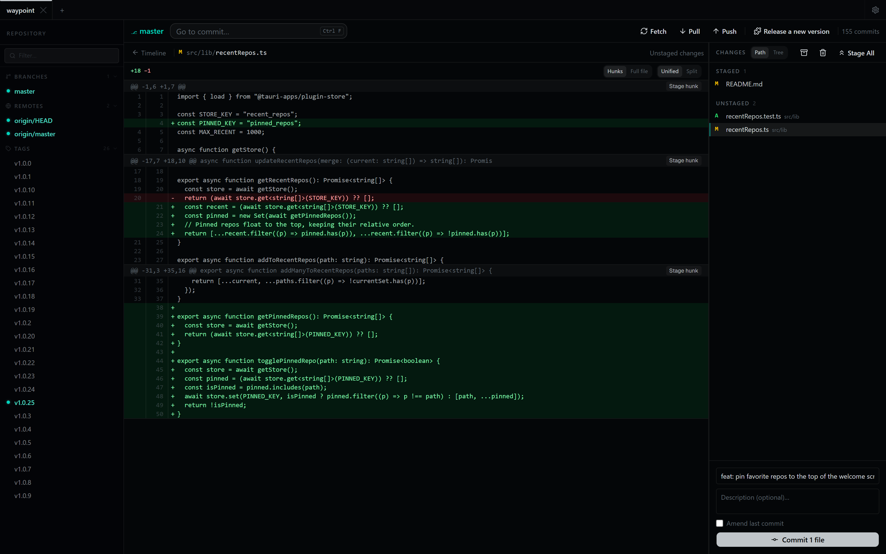
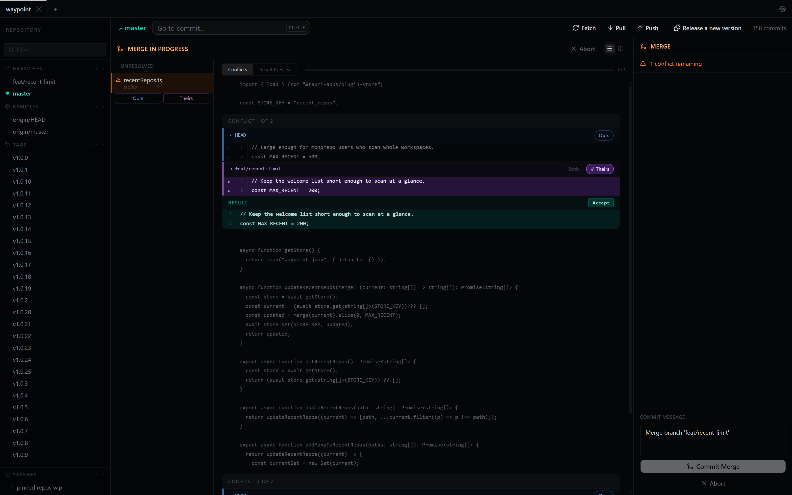
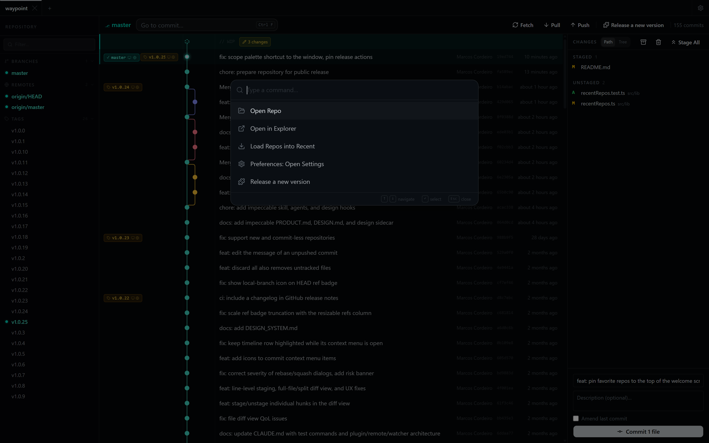

<div align="center">
  
  <h1>Waypoint</h1>
  <p><strong>A fast, local Git GUI built around a visual commit timeline.</strong><br>
  No account. No telemetry. No paywall.</p>
  <p>
    <a href="LICENSE"></a>
    
    
  </p>
  <p>
    <a href="#download">Download</a> ·
    <a href="#features">Features</a> ·
    <a href="docs/plugins.md">Plugins</a> ·
    <a href="#development">Build from source</a>
  </p>
</div>

<br>



Waypoint talks only to your local repositories and the remotes you already have configured. It's built with Tauri 2 and a Rust + libgit2 backend, so it starts fast, stays small, and loads your whole history with no commit cap.

## Features

### Read history at a glance

The timeline lays out branches and merges in colored lanes, with refs, tags, and stashes inline and a pinned row for uncommitted work.

- **Go to commit:** search by message, author, email, hash, or branch/tag and step through matches in place (Ctrl/Cmd+F)
- **"Check if in branch…"** on any commit
- Refreshes live when files change outside the app

### Review every change



- Unified or split view, changed hunks or the full file
- Commit details and the file list beside the diff; move between files with `[` / `]`

### Stage exactly what you mean



- Stage or unstage by folder, file, hunk, or single line
- Commit, amend (with a warning if the commit is already pushed), or edit the message of any commit
- Discard changes per file, per folder, or everything

### Resolve conflicts hunk by hunk



- For each conflict, take ours, theirs, or both, or pick individual lines
- Stacked or side-by-side view, with a preview of the result before it's written

### Everything a keystroke away



The command palette (Ctrl/Cmd+Shift+P) reaches repo actions, settings, and any commands your plugins add.

### And the rest

- **Branches:** create, rename, delete, and check out (including detached and remote branches)
- **History editing:** merge, rebase, cherry-pick, revert, soft/mixed/hard reset, and squash a selected range with a preview
- **Remotes:** fetch, pull, and push, with a force-push offer when a push is rejected; push and delete remote tags; rename a branch on the remote. Remote operations run through your system `git`, so credential helpers and SSH agents work as they do in your terminal
- **Tags and stashes:** annotated and lightweight tags; named stashes you can pop, apply, drop, and rename
- **Repos:** multiple repos as tabs, recent repos on the welcome screen, a folder scan to find repos, and `git init` for folders that aren't repositories yet
- **Integrations:** a `waypoint .` terminal command (Settings → Integrations) and, on Windows, an "Open in Waypoint" Explorer context menu

### Keyboard shortcuts

| Shortcut | Action |
|---|---|
| Ctrl/Cmd+Shift+P | Command palette |
| Ctrl/Cmd+F | Go to commit |
| Enter / Shift+Enter, F3 / Ctrl+G | Next / previous match |
| Ctrl/Cmd+Enter | Commit |
| `[` / `]` or Alt+↑ / Alt+↓ | Previous / next file in a diff |
| Esc | Close the diff |

## Plugins

Plugins are small JavaScript packages (local folders or GitHub repos) that add your own commands to the command palette, commit and branch context menus, and the toolbar. For example, a one-click "create the next release branch" for your team's workflow.

See **[docs/plugins.md](docs/plugins.md)** for the manifest schema, the full `api` reference, and how-tos. A ready-to-copy starting point lives in **[`example-plugin/`](example-plugin)**.

## Download

Installers are attached to each [release](../../releases):

| Platform | Format |
|---|---|
| macOS (Apple Silicon + Intel) | `.dmg` (universal binary) |
| Linux (x64, glibc 2.35+) | `.AppImage` (portable), `.deb` (Debian/Ubuntu), or `.rpm` (Fedora/openSUSE) |
| Windows (x64) | `.msi` (recommended; includes the Explorer context menu) or `.exe` (NSIS) |

Builds are currently **not code-signed**:
- **macOS** reports the app as damaged. After copying it to Applications, run `xattr -dr com.apple.quarantine /Applications/Waypoint.app`.
- **Windows** SmartScreen may warn on first launch. Choose "More info" → "Run anyway".

`git` must be on your `PATH` for fetch, pull, and push.

## Known limitations

- No clone yet: clone in a terminal, then open the folder.
- Commits are created through libgit2, so commit signing (GPG/SSH) and git hooks are not applied.
- Stashes don't include untracked files.
- Waypoint fetches from your remotes in the background: when a repo opens, every 5 minutes, and when the window regains focus.
- Dark theme only.

## Development

**Prerequisites (all platforms):** Rust stable ([rustup](https://rustup.rs)), Node.js 22.13+, pnpm 10, and `git`.

- **Windows:** Visual Studio C++ Build Tools ("Desktop development with C++"), the MSVC Rust toolchain, and a native Perl such as [Strawberry Perl](https://strawberryperl.com) (OpenSSL is built from source; Git Bash's Perl won't work).
- **macOS:** Xcode Command Line Tools (`xcode-select --install`).
- **Linux (Debian/Ubuntu):** `sudo apt install build-essential file perl libwebkit2gtk-4.1-dev libappindicator3-dev librsvg2-dev patchelf pkg-config`

```bash
pnpm install          # install dependencies
pnpm tauri dev        # run the app with hot reload
pnpm test run         # frontend tests (Vitest)
cd src-tauri && cargo test   # backend tests
pnpm tauri build      # production build + installers
```

For a universal macOS build: `rustup target add aarch64-apple-darwin x86_64-apple-darwin`, then `pnpm tauri build --target universal-apple-darwin`.

After changing dependencies, regenerate the bundled license notices with `pnpm notices`.

### Tech stack

- **Frontend:** React 19, TypeScript, Tailwind CSS v4, Zustand, TanStack Query, [shadcn/ui](https://ui.shadcn.com) components
- **Desktop:** Tauri 2, with a Rust backend using libgit2 (`git2` crate) for local operations
- **Build:** Vite, pnpm

### Releasing

Push a version tag to trigger the release workflow:

```bash
git tag v1.2.3
git push origin v1.2.3
```

GitHub Actions builds macOS (universal), Linux, and Windows installers and attaches them to a draft GitHub Release with a generated changelog. Tags with a hyphen (e.g. `v1.3.0-beta.1`) are marked as pre-releases.

macOS signing and notarization turn on when the `APPLE_*` secrets are set and are skipped otherwise. Windows code signing is not set up.

## License

[MIT](LICENSE). Waypoint bundles third-party software under its own licenses; see [THIRD_PARTY_NOTICES.md](THIRD_PARTY_NOTICES.md).
